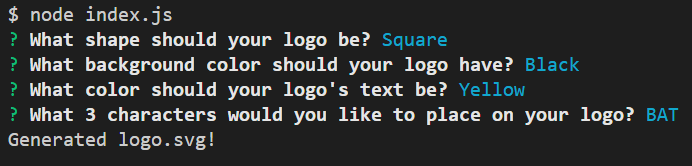

# SVG Logo Maker

[Link to Video](https://drive.google.com/file/d/1h5lyhLXxMzBWi_EADXSlqe_Wp7J--bxD/view)

[Sample svg created with App](./sampleLogo.svg)

## Description
This app creates an svg logo based on user inputs regarding shape, background color, text color, and the text itself.

## Screenshot

## Installation
* Download the requisite files to your computer from GitHub.
* In the console, use the `npm i` command to install the required node modules. 

## Usage
* Open the app's folder in the terminal.
* Use the `node index.js` or `npm start` command to start the app. 
* Answer the series of prompts to create your svg file.
* Colors can be hexadecimal or color keywords. 
* In the event the colors are not recognized from input, they will default to black.
* Following the prompts, you will receive the "Generated logo.svg!" response in the terminal if successful.
* The logo will be located in the `svg-logo-maker` folder as `logo.svg`.
* Thanks for using my app!

## Testing
* To run tests, type `npm test` in the terminal while running from the SVG-LOGO-MAKER folder

## References
[Reference for `validation` in text length prompt](https://stackoverflow.com/questions/57321266/how-to-test-inquirer-validation)

## License
Please refer to the license in the repo.

- - -

 